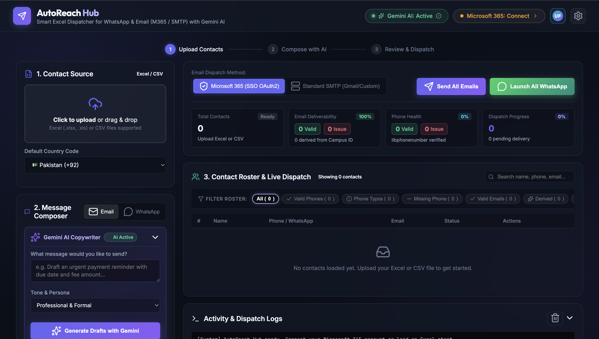
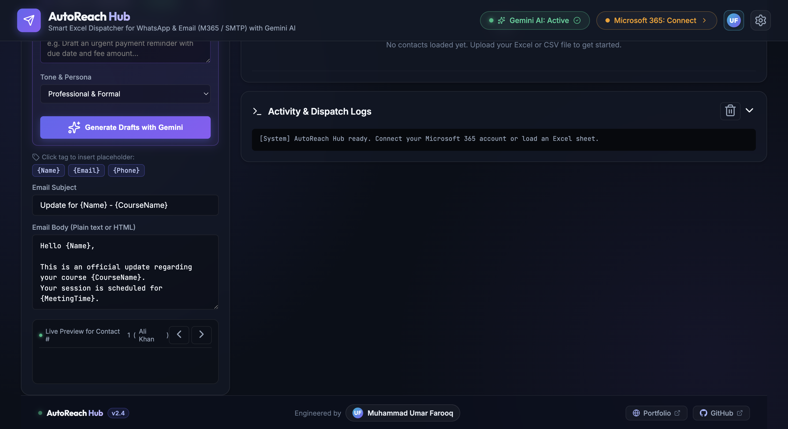
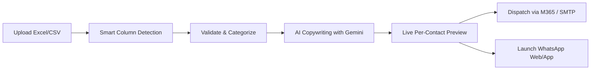

# 🚀 AutoReach Hub — Smart Multi-Channel Outreach & Automation

<div align="center">

[](https://python.org)
[](https://flask.palletsprojects.com/)
[](https://ai.google.dev/)
[](https://developer.microsoft.com/graph)
[](https://whatsapp.com)
[](LICENSE)

<p align="center">
  <strong>An enterprise-grade, privacy-first automation platform that streamlines multi-category contact management, generates high-converting AI cold copy, and dispatches personalized emails and WhatsApp messages at scale.</strong>
</p>

[Explore Features](#-key-features) • [Dashboard Tour](#-visual-walkthrough) • [Quick Start](#-quick-start) • [Configuration](#%EF%B8%8F-configuration) • [Architecture](#-architecture)

</div>

---

## 📸 Visual Walkthrough

### 1. Modern Glassmorphic Dashboard & Multi-Channel Dispatcher
Intuitive 3-step workflow: Upload roster, generate personalized messages with Gemini AI, and execute targeted campaigns via Microsoft 365 or WhatsApp.

<div align="center">
  
</div>

<br/>

### 2. Live Dynamic Preview & Real-Time Dispatch Terminal
Inspect per-contact variable substitutions in real-time (`{Name}`, `{CourseName}`, `{MeetingTime}`) with live terminal logging and deliverability health checks.

<div align="center">
  
</div>

---

## ✨ Key Features

| Feature | Description |
| :--- | :--- |
| **🪄 Google Gemini AI Assistant** | Integrated copywriter generating contextual subject lines, email bodies, and WhatsApp messages with selectable tone presets (*Professional, Friendly, Urgent, Academic, Persuasive*). |
| **📁 Category Management** | Tag and group contacts dynamically into custom categories (*e.g., VIP, Leads, Students, Partners*) with multi-category filtering and selective batch targeting. |
| **🔐 Microsoft 365 Graph API** | Native SSO & MFA authentication via Microsoft Device Code Flow (`microsoft.com/devicelogin`). Sent emails appear directly in your official institutional **Sent Items** mailbox. |
| **⚡ SMTP Multi-Provider** | Support for Gmail App Passwords and custom SMTP relays with customizable `From Name` and `Reply-To` headers. |
| **💬 UTF-8 WhatsApp Launcher** | Generates zero-ban-risk `wa.me` links with UTF-8 URL encoding, fully preserving emojis (👋, 🚀, 🎉) and international formatting. |
| **🩺 Phone & Email Health** | Uses Google's `libphonenumber` to auto-normalize international prefixes (+1, +44, +92, etc.) and highlight malformed records. |
| **🏷️ Dynamic Variable Engine** | Use any column from your Excel or CSV as a tag (`{Name}`, `{Email}`, `{RollNumber}`, `{Department}`, `{DueAmount}`) with instantaneous live preview. |
| **📱 Mobile-Ready Responsive UI** | Control campaigns on your local Wi-Fi from iPhone, iPad, or Android devices with native WhatsApp app deep-linking. |

---

## 🚀 Quick Start

### Prerequisites
- **Python 3.9+** installed on your system.

### 1. Clone the Repository
```bash
git clone https://github.com/omerfarooq223/AutoReach-Hub.git
cd AutoReach-Hub
```

### 2. One-Click Launchers

#### 🍎 macOS & 🐧 Linux:
```bash
chmod +x run.sh
./run.sh
```

#### 🪟 Windows:
```cmd
run.bat
```

> **Note:** The 1-click launcher automatically creates `.venv`, installs dependencies from `requirements.txt`, opens your default browser at `http://127.0.0.1:8080`, and runs the server.

---

### Manual Setup (Alternative)

```bash
# 1. Create and activate virtual environment
python3 -m venv .venv
source .venv/bin/activate       # On Windows use: .venv\Scripts\activate

# 2. Install dependencies
pip install -r requirements.txt

# 3. Start the Flask application
python3 app.py
```
Visit **`http://127.0.0.1:8080`** in your browser.

---

## ⚙️ Configuration

Create a `.env` file in the root directory (copied from [`.env.example`](.env.example)):

```env
# Google Gemini AI API Key (for smart AI message composer)
GEMINI_API_KEY=your_gemini_api_key_here

# Microsoft 365 / Graph API Configuration (Device Code Flow)
MS_CLIENT_ID=04b07795-8ddb-461a-bbee-02f9e1bf7b46
MS_AUTHORITY=https://login.microsoftonline.com/organizations

# SMTP Email Configuration (Gmail / Custom SMTP)
SMTP_HOST=smtp.gmail.com
SMTP_PORT=587
SMTP_USE_SSL=false
SMTP_USE_TLS=true
SMTP_USERNAME=your_email@gmail.com
SMTP_PASSWORD=your_gmail_app_password
DEFAULT_FROM_NAME=Academic / Admin Department
DEFAULT_REPLY_TO=contact@institution.edu

# WhatsApp Defaults
DEFAULT_COUNTRY_CODE=92
```

> 💡 **Tip:** You can also enter and test your **Gemini API Key** and **SMTP credentials** directly inside the web UI Settings Modal.

---

## 📖 Step-by-Step Workflow



1. **Upload Roster:** Drag & drop any `.xlsx`, `.xls`, or `.csv` contact spreadsheet. AutoReach Hub automatically maps columns (`Name`, `Phone`, `Email`, `Category`).
2. **Assign Categories:** Filter or bulk-assign contacts to categories for targeted segmentation.
3. **Draft with Gemini AI:** Select a tone (*Professional, Friendly, Urgent, Persuasive*), describe your campaign objective, and click **Generate Drafts with Gemini**.
4. **Inspect Live Previews:** Slide through individual contacts to inspect real-time variable substitutions before sending.
5. **Execute Dispatch:** 
   - **Email:** One-click dispatch via authenticated Microsoft 365 OAuth2 or secure SMTP relay.
   - **WhatsApp:** Click-to-chat triggers native WhatsApp desktop/web applications with pre-filled, personalized text.

---

## 📱 Mobile Network Access

AutoReach Hub binds to `0.0.0.0`, allowing you to operate campaigns from your smartphone or tablet over the same Wi-Fi network:

1. Locate your computer's local IP address (e.g. `192.168.1.15`).
2. Open your mobile browser: `http://192.168.1.15:8080`
3. Tapping **"WA"** launches the native **WhatsApp mobile application** directly with the formatted message loaded!

---

## 🏗️ Project Architecture

```
AutoReach-Hub/
├── ai_handler.py            # Google Gemini AI copy generation & prompt engine
├── app.py                   # Flask REST API backend & static file server
├── cli.py                   # Interactive Command-Line Interface (CLI)
├── config.py                # Environment and application settings
├── excel_handler.py         # Multi-category parser, column matcher & sanitization engine
├── graph_mail_handler.py    # Microsoft Graph API OAuth2 Device Code dispatcher
├── smtp_handler.py          # SMTP email handler with UTF-8 multi-part support
├── whatsapp_handler.py      # WhatsApp Click-to-Chat URL generator with UTF-8 encoding
├── test_automation.py       # Comprehensive unit test suite
├── requirements.txt         # Core Python dependencies
├── .env.example             # Template for environment configuration
├── run.sh                   # 1-Click launcher for macOS & Linux
├── run.bat                  # 1-Click launcher for Windows
├── templates/
│   └── index.html           # Modern glassmorphic web dashboard
├── static/
│   ├── style.css            # Dark mode glassmorphism design system
│   ├── app.js               # Frontend application controller
│   ├── favicon.svg          # Brand favicon
│   └── lucide.min.js        # Bundled offline Lucide icon set
└── docs/
    └── screenshots/         # Dashboard previews & visual assets
```

---

## 🧪 Running Unit Tests

Run the built-in test suite to verify data normalization, category handling, and dispatch engines:

```bash
python3 -m unittest test_automation.py
```

---

## 🛡️ Privacy & Compliance

- **No Remote Database:** All contact lists, Excel files, and campaign logs are processed locally in your machine's memory and local files.
- **Official API Auth:** Microsoft 365 integration uses standard Microsoft Device Code OAuth2 without storing passwords.
- **Zero WhatsApp Ban Risk:** Uses standard `wa.me` Click-to-Chat protocol, ensuring 100% compliance with WhatsApp Terms of Service.

---

## 📄 License

This project is licensed under the MIT License — see the [LICENSE](LICENSE) file for details.

<div align="center">
  <sub>Engineered with ❤️ by <strong>Muhammad Umar Farooq</strong></sub>
</div>
